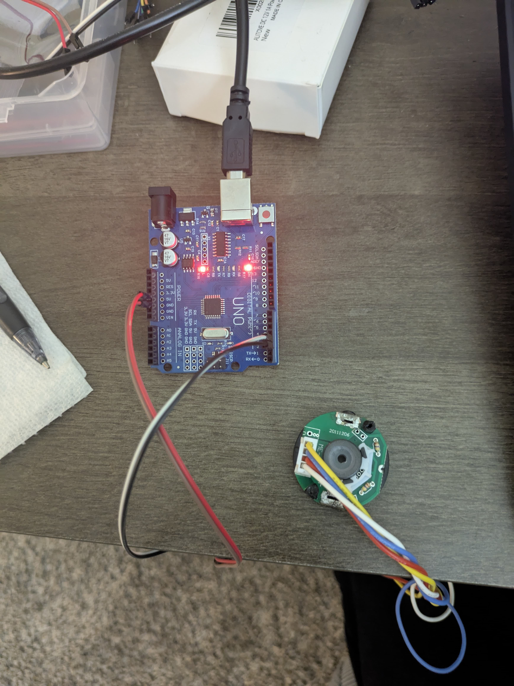

# read_encoder_gobilda  
**Rotary Encoder Angle, ΔAngle, and Velocity using PlatformIO + Arduino**

This project reads a **quadrature rotary encoder** (Channel A / Channel B) using the **Paul Stoffregen Encoder library** and computes:

- Encoder **count**
- **Absolute angle** (degrees and radians)
- **Change in angle** (Δθ)
- **Angular velocity** (rad/s)
- Encoder **zeroing** (startup + serial command)

This code is intended as a **clean, reusable baseline** for robotics and mechatronics projects such as joint sensing, PD control, impedance control, and rehabilitation devices.




---

## 1. Hardware Setup

### Required Hardware
- Quadrature rotary encoder (4 pins: **VCC, GND, CH-A, CH-B**)
- Arduino board (Uno / Nano / Mega class)
- USB cable
- PC with VS Code + PlatformIO

### Wiring

| Encoder Pin | Arduino Pin | Notes |
|------------|-------------|------|
| VCC | 5V | Use 3.3V only if encoder requires it |
| GND | GND | Common ground is mandatory |
| CH-A | D2 | Interrupt-capable pin |
| CH-B | D3 | Interrupt-capable pin |

**Notes**
- If rotation direction is reversed, swap **CH-A and CH-B**
- Keep wires short and clean
- Avoid routing encoder wires near motor power lines

---

## 2. What This Code Does

The firmware performs the following steps continuously:

1. Reads quadrature encoder counts
2. Converts counts to angle:
   - Degrees:  
     `θ(deg) = count × (360 / COUNTS_PER_REV)`
   - Radians:  
     `θ(rad) = count × (2π / COUNTS_PER_REV)`
3. Computes change in angle:
   - `Δθ = currentCount − previousCount`
4. Computes angular velocity:
   - `ω = Δθ(rad) / dt`
5. Prints data periodically to Serial Monitor
6. Supports encoder zeroing:
   - Automatically at startup
   - Manually via serial command (`z`)


## 4. Software Requirements

- **VS Code**
- **PlatformIO Extension**
- Supported boards: Arduino Uno / Nano / Mega

### Library Dependency
This project uses:
- **Encoder** by Paul Stoffregen

PlatformIO installs it automatically via:

```ini
lib_deps = paulstoffregen/Encoder
[env:arduino_uno]
platform = atmelavr
board = uno
framework = arduino

lib_deps =
    paulstoffregen/Encoder

monitor_speed = 115200
```


## 5. Serial Output
Count: 250 | Angle(deg): 62.50 | dAngle(deg): 1.25 | omega(rad/s): 0.218 | dir: ++


## 6. Run Time command:
>> z
To zero the encoder count
=== ENCODER ZEROED (count=0, angle=0) ===

## 7. Set ENcoder Resolution
#define COUNTS_PER_REV 1440.0


